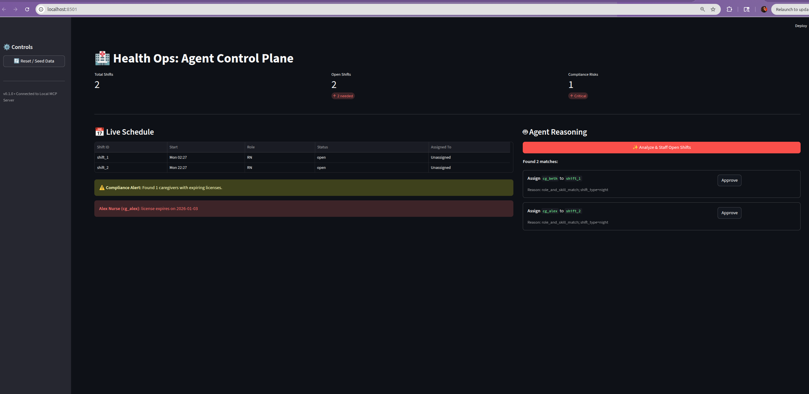

# Health Ops MCP

A Model Context Protocol (MCP) server that demonstrates **autonomous workforce orchestration** for post-acute care.

This project models a "System of Action" architecture. It runs an AI agent alongside the EMR to automate scheduling, detect conflicts, and enforce compliance guardrails.

## Demo

**[Watch the 5-minute Technical Deep Dive](https://youtu.be/Me-UrRhvh_A)**
*(Jump to 2:22 for the Agent Staffing Logic)*



## Key Capabilities

This system exposes standard MCP tools that allow an LLM to manage a synthetic home-care workforce:

- **Intelligent Staffing**: Suggests assignments based on role (RN/LPN), skills (Wound Care), and shift preferences (Day/Night).
- **Conflict Detection**: Prevents double-booking by validating schedule overlaps before assignment.
- **Compliance Guardrails**: Proactively flags expiring licenses (e.g., "RN License expires in <30 days").
- **Human-in-the-Loop**: A Streamlit Control Plane to visualize and approve agent actions.

## Architecture

The project consists of two components:
1. **MCP Server** (`server.py`): The backend logic and in-memory data store.
2. **Control Plane** (`dashboard.py`): A Streamlit UI for humans to audit agent decisions.

## Quick Start

### Prerequisites
- Python 3.12+
- `uv` (recommended) or `pip`

### 1. Install Dependencies

```bash
# Using uv (Recommended)
uv sync

# OR using pip
pip install -r requirements.txt
```

### 2. Run the Control Plane (Dashboard)
The dashboard visualizes the schedule and allows you to reset the simulation data.

```bash
uv run streamlit run health_ops_mcp/dashboard.py
```
*Access at: http://localhost:8501*

### 3. Run the MCP Server (for Agent Integration)
To connect this server to an LLM client (like Claude Desktop or a custom Agent Builder):

```bash
mcp dev health_ops_mcp/server.py
```

## Example Workflow

Once the server is running, an Agent can execute the following loop:

1. **Context Gathering**
   - Call `list_open_shifts(location="loc_nyc")`
   - *Result*: Returns unassigned shifts requiring specific skills.

2. **Reasoning**
   - Call `suggest_assignments(strategy="fair_load")`
   - *Result*: "Assign Nurse Beth (matches Skill: Pediatrics + Shift: Night)."

3. **Action**
   - Call `assign_shift(shift_id="shift_1", caregiver_id="cg_beth")`
   - *Result*: Updates the schedule and returns the action source.

4. **Audit**
   - Call `list_expiring_compliance(days_ahead=30)`
   - *Result*: Returns a list of caregivers who cannot be scheduled next month due to expiring credentials.

## Project Structure


```text
health-ops-mcp/
├── health_ops_mcp/
│   ├── dashboard.py    # Streamlit Control Plane (UI)
│   ├── server.py       # MCP Tool Definitions & Entrypoint
│   ├── storage.py      # In-Memory Database & Seeding Logic
│   └── models.py       # Pydantic Schemas
├── pyproject.toml      # Dependency Config
└── README.md
```